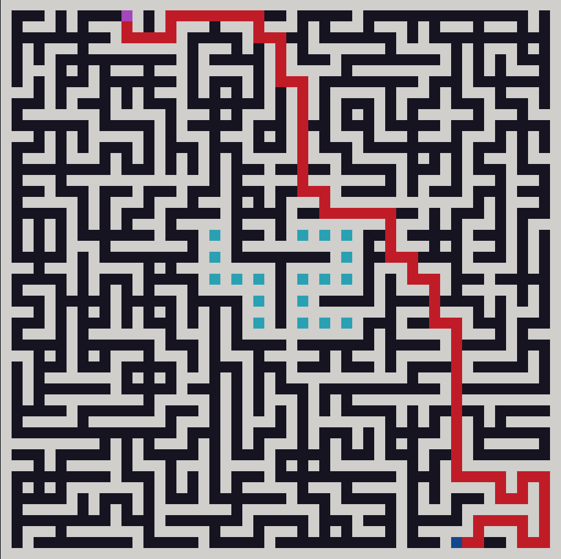

# A-Maze-ing


A Python maze generator that produces reproducible mazes from a simple config file, encodes them in a compact hex wall format, and visualises generation in real time.



*A 25×25 maze. Entry is the purple cell (top-left), exit is the blue cell (bottom-right), the cyan cells in the middle form the enclosed "42" pattern, and the red line traces the shortest path between entry and exit.*

## Table of Contents
- [Overview](#overview)
- [Installation and Usage](#installation-and-usage)
- [Make Commands](#make-commands)
- [Configuration](#configuration)
- [Output Format](#output-format)
- [Algorithms](#algorithms)
- [Use as a Library](#use-as-a-library)
- [Project Notes](#project-notes)

## Overview

The program reads a config file and generates a maze according to its parameters. It supports both perfect mazes (exactly one path between any two cells) and imperfect mazes (containing loops). Any maze can be reproduced exactly by passing the same seed.

Every generated maze embeds a "42" pattern in the centre, formed by fully enclosed cells. If the maze is too small to fit the pattern, it is omitted with a warning.

**Constraints**
- No open area may exceed 2 cells in width or height — large rooms are not allowed.
- Shared walls between adjacent cells are kept consistent across both cells.
- Entry and exit must be distinct and lie within the maze bounds.
- The outer border is fully walled.
- In perfect mode, exactly one path exists between entry and exit.

## Installation and Usage

Clone the repo and run:

```bash
make run
```

This installs dependencies into a virtual environment (via `make install`) and launches the program. The default config is read from `config.txt` in the project root.

## Make Commands

| Command | Description |
|---|---|
| `make install` | Creates a virtual environment and installs everything in `requirements.txt`. |
| `make run` | Runs `make install` if needed, then launches the program inside the venv. |
| `make debug` | Runs the program under `pdb`. |
| `make lint` | Runs `flake8` and `mypy` on the source. |
| `make lint-strict` | Same as `lint` but with `mypy --strict`. |
| `make clean` | Removes runtime artefacts and `__pycache__` directories. |

**Dependencies** (installed automatically): `pydantic`, `pydantic-settings`, `pydantic_core`, `python-dotenv`, `flake8`, `mypy`, `librt`, and their transitive dependencies. Full list pinned in `requirements.txt`.

## Configuration

```ini
seed=0
width=20
height=20
entry=0,0
exit=19,19
output_file=maze.txt
perfect=true
```

| Parameter | Notes |
|---|---|
| `seed` | Generated first, then used to derive every other randomised parameter. Same seed → same maze. |
| `width`, `height` | Min 4×4, max 25×25 (in a bigger screen there could a maze bigger than 25x25). `height` is never greater than `width`.|
| `entry`, `exit` | Must differ; neither may fall inside the "42" pattern. |
| `output_file` | Path for the encoded output. |
| `perfect` | `true` for a perfect maze (Prim's), `false` for one with loops (Hunt-and-Kill). |

The minimum size for the "42" pattern to fit is 7×9.

## Output Format

Each cell is encoded as a single hexadecimal digit. Each of its 4 bits represents a wall on one side:

| Bit | Wall |
|---|---|
| 8 | North |
| 4 | East |
| 2 | South |
| 1 | West |

So a cell with walls on the north and west sides is `8 + 1 = 9`. A fully enclosed cell is `f`. The output file contains the grid, the entry and exit coordinates, and the shortest path between them as a sequence of cardinal directions (`N`, `E`, `S`, `W`).

## Algorithms

Two algorithms are implemented, selected by the `perfect` config option:

- **Prim's algorithm** — used for perfect mazes. Always produces exactly one path between any two cells, which matches the "perfect maze" definition naturally.
- **Hunt-and-Kill** — used for imperfect mazes. Easy to modify so that some walls are knocked down after generation, introducing loops.

Generation is visualised in real time as the algorithm runs.

## Use as a Library

The package is published on PyPI:

```bash
pip install a-maze-ing-generator-il-lu
```

```python
from mazegen_il_lu import MazeGenerator

MazeGenerator(
    seed=42,
    width=20,
    height=20,
    entry=(0, 0),
    exit=(19, 19),
    output_file="maze.txt",
    perfect=True,
).generate()
```

## Project Notes

### Authors
- [Ilias Kolokousis](https://github.com/ilias-kolokousis)
- [Luuk van Hemmen](https://github.com/KULUSKULS)

### Process
Roles were divided naturally — we listed the tasks, picked the ones we wanted, and each wrote one of the two algorithms. Communication ran through Slack and code review through GitHub. Steady progress throughout, no major roadblocks. The main thing we'd do differently next time is schedule fixed meeting times instead of catching up ad hoc.

### AI Usage
Claude (Sonnet 4.5) was used to discuss implementation approaches, clarify Makefile and Python syntax, and help resolve `mypy` errors.

### References
- [Python Makefile guide](https://earthly.dev/blog/python-makefile/)
- [Prim's algorithm (video)](https://www.youtube.com/watch?v=20QfaLQPLqQ)
- [Maze generation algorithms (video)](https://www.youtube.com/watch?v=ioUl1M77hww)
- [Prim's vs Kruskal's](https://www.geeksforgeeks.org/dsa/difference-between-prims-and-kruskals-algorithm-for-mst/)

---

*Created as part of the 42 curriculum by ikolokou and lvan-hem.*
